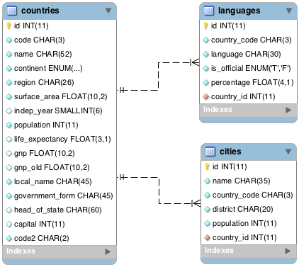
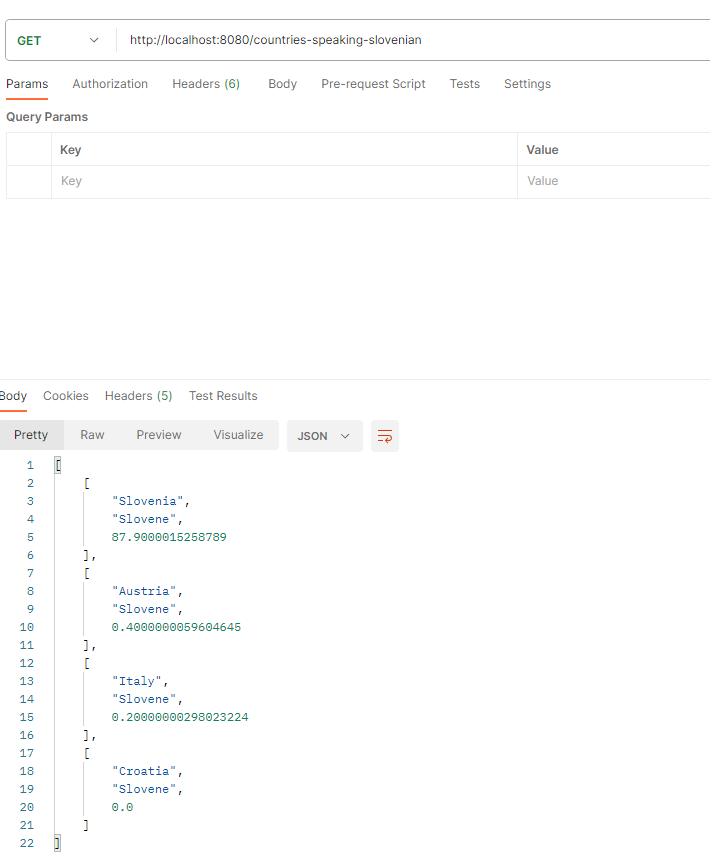
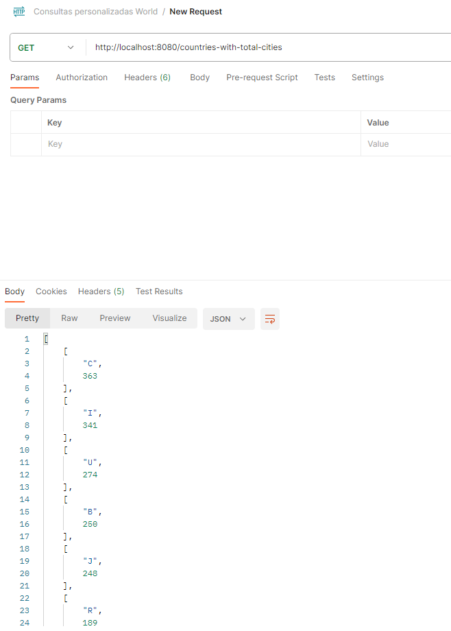
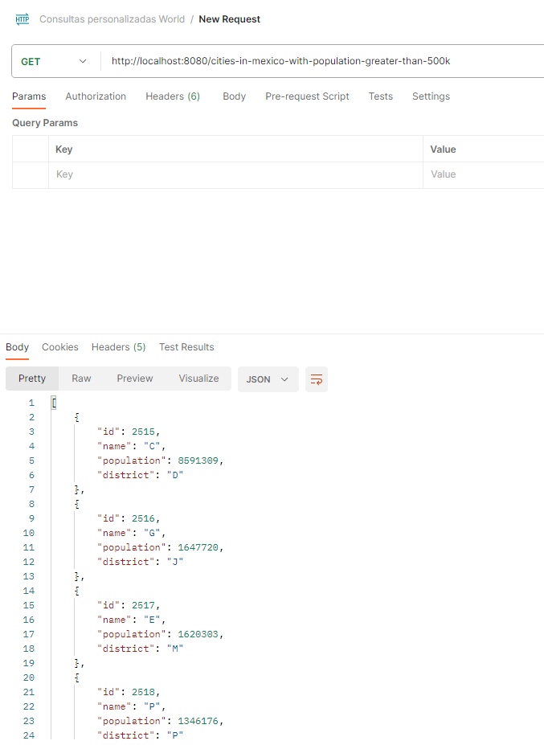

# API REST para consultas SQL personalizadas con JPA

### Creando consultas SQL desde el framework para traer datos de la base de datos World.

Si se desea probar el proyecto puede descargar la base de datos utilizada desde este link:
<a href="https://assets.codingdojo.com/boomyeah/company_209/chapter_3569/handouts/chapter3569_5432_world.sql">World</a>

### Características

- Consultas personalizadas JPA

  
  
  
  

